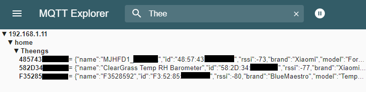

# Use

## Launching the gateway

### For a regular installation
```shell
python -m TheengsGateway -H "<mqtt_broker_host_ip>" -u "username" -p "password"
```

### For a Docker container
To run it with minimum required parameters required:
```shell
docker run --rm \
    --network host \
    -e MQTT_HOST=<mqtt_broker_host_ip> \
    -v /var/run/dbus:/var/run/dbus \
    --name TheengsGateway \
    theengs/gateway
```

:::tip
If your mqtt broker is installed on the same instance as the gateway you can use `localhost` as the `<mqtt_broker_host_ip>`.
:::

### Checking the data published by the gateway
Once the command launched you should see MQTT payloads appearing on the broker. To visualize these data you have to use an [MQTT client tool](../prerequisites/broker).



Example payload received:
```json
{"name":"F35285","id":"F3:52:85","rssi":-82,"brand":"BlueMaestro","model":"TempoDisc","model_id":"BM_V23","tempc":24.1,"tempf":75.38,"hum":104.7,"dp":24.8,"volt":2.56,"mfr":"Blue Maestro Limited"}
```

The `mfr` key has the company name of the manufacturer as its value in two cases:

* The advertisement of the device has been successfully decoded, its manufacturer data have a company ID compliant to the Bluetooth specification, and it's no beacon (iBeacon, Microsoft Advertising Beacon).
* The advertisement of the device can't be decoded.

Note that in the latter case, we can't guarantee that the manufacturer name is correct, as many devices are not compliant to the Bluetooth specification and encode their data in the bytes where the manufacturer ID should be.

## Details options
### For a regular installation

```shell
C:\Users\1technophile>python -m TheengsGateway -h
usage:    [-h] [-H HOST] [-P PORT] [-u USER] [-p PWD] [-pt PUB_TOPIC] [-Lt LWT_TOPIC]
          [-st SUB_TOPIC] [-pa PUBLISH_ALL] [-sd SCAN_DUR] [-tb TIME_BETWEEN]
          [-ll {DEBUG,INFO,WARNING,ERROR,CRITICAL}] [-Dt DISCOVERY_TOPIC] [-D DISCOVERY] [-Dh HASS_DISCOVERY]
          [-Dn DISCOVERY_DEVICE_NAME] [-Df DISCOVERY_FILTER [DISCOVERY_FILTER ...]]
          [-prt PRESENCE_TOPIC] [-pr PUBLISH_PRESENCE]
          [-a ADAPTER] [-s {active,passive}] [-ts TIME_SYNC [TIME_SYNC ...]]
          [-tf TIME_FORMAT] [-padv PUBLISH_ADVDATA]
          [-bk ADDRESS [BINDKEY ...]] [-tls ENABLE_TLS]
          [-ws ENABLE_WEBSOCKET] [-id ADDRESS [IRK ...]]

optional arguments:
  -h, --help            show this help message and exit
  -H HOST, --host HOST  MQTT host address
  -P PORT, --port PORT  MQTT host port
  -u USER, --user USER  MQTT username
  -p PWD, --pass PWD    MQTT password
  -pt PUB_TOPIC, --pub_topic PUB_TOPIC
                        MQTT publish topic
  -st SUB_TOPIC, --sub_topic SUB_TOPIC
                        MQTT subscribe topic
  -Lt LWT_TOPIC, --lwt_topic LWT_TOPIC
                        MQTT LWT topic
  -pa PUBLISH_ALL, --publish_all PUBLISH_ALL
                        Publish all (1) or only decoded (0) advertisements (default:
                        1)
  -sd SCAN_DUR, --scan_duration SCAN_DUR
                        BLE scan duration (seconds)
  -tb TIME_BETWEEN, --time_between TIME_BETWEEN
                        Seconds to wait between scans
  -ll {DEBUG,INFO,WARNING,ERROR,CRITICAL}, --log_level {DEBUG,INFO,WARNING,ERROR,CRITICAL}
                        TheengsGateway log level
  -Dt DISCOVERY_TOPIC, --discovery-topic DISCOVERY_TOPIC
                        MQTT Discovery topic
  -D DISCOVERY, --discovery DISCOVERY
                        Enable(1) or disable(0) MQTT discovery
  -Dh HASS_DISCOVERY, --hass_discovery HASS_DISCOVERY
                        Enable(1) or disable(0) Home Assistant-specific MQTT
                        discovery (default: 1)                        
  -Dn DISCOVERY_DEVICE_NAME, --discovery_name DISCOVERY_DEVICE_NAME
                        Device name for Home Assistant
  -Df DISCOVERY_FILTER [DISCOVERY_FILTER ...], --discovery_filter DISCOVERY_FILTER [DISCOVERY_FILTER ...]
                        Device discovery filter list for Home Assistant
  -prt PRESENCE_TOPIC, --presence_topic PRESENCE_TOPIC
                        MQTT topic to publish presence messages
  -pr PUBLISH_PRESENCE, --presence PUBLISH_PRESENCE
                        Enable (1) or disable (0) publishing presence messages
  -a ADAPTER, --adapter ADAPTER
                        Bluetooth adapter (e.g. hci1 on Linux)
  -s {active,passive}, --scanning_mode {active,passive}
                        Scanning mode (default: active)
  -ts TIME_SYNC [TIME_SYNC ...], --time_sync TIME_SYNC [TIME_SYNC ...]
                        Addresses of Bluetooth devices to synchronize the time
  -tf TIME_FORMAT, --time_format TIME_FORMAT
                        Use 12-hour (1) or 24-hour (0) time format for clocks
                        (default: 0)
  -padv PUBLISH_ADVDATA, --publish_advdata PUBLISH_ADVDATA
                        Publish advertising and advanced data (1) or not (0)
                        (default: 0)
  -bk ADDRESS [BINDKEY ...], --bindkeys ADDRESS [BINDKEY ...]
                        Device addresses and their bindkeys: ADDR1 KEY1 ADDR2 KEY2
  -tls ENABLE_TLS, --enable_tls ENABLE_TLS
                        Enable (1) or disable (0) TLS (default: 0)
  -ws ENABLE_WEBSOCKET, --enable_websocket ENABLE_WEBSOCKET
                        Enable (1) or disable (0) WebSocket (default: 0)
  -id ADDRESS [IRK ...], --identities ADDRESS [IRK ...]
                        Identity addresses and their IRKs: ADDR1 IRK1 ADDR2 IRK2
```

### For a Docker container

```shell
docker run --rm \
    --network host \
    -e MQTT_HOST=<host_ip> \
    -e MQTT_USERNAME=<username> \
    -e MQTT_PASSWORD=<password> \
    -e MQTT_PUB_TOPIC=home/TheengsGateway/BTtoMQTT \
    -e MQTT_SUB_TOPIC=home/+/BTtoMQTT/undecoded \
    -e PUBLISH_ALL=true \
    -e TIME_BETWEEN=60 \
    -e SCAN_TIME=60 \
    -e LOG_LEVEL=INFO \
    -e HAAS_DISCOVERY=true \
    -e DISCOVERY=true \
    -e DISCOVERY_TOPIC=homeassistant \
    -e DISCOVERY_DEVICE_NAME=TheengsGateway \
    -e DISCOVERY_FILTER="[IBEACON,GAEN,MS-CDP,APPLE_CONT,APPLE_CONTAT]" \
    -e SCANNING_MODE=active \
    -e ADAPTER=hci0 \
    -v /var/run/dbus:/var/run/dbus \
    --name TheengsGateway \
    theengs/gateway
```

## Publish to a 2 levels topic

```shell
python -m TheengsGateway -H "192.168.1.17" -u "username" -p "password" -pt "home/TheengsGateway"
```

## Scan every 55s

```shell
python -m TheengsGateway -H "192.168.1.17" -u "username" -p "password" -pt "home/TheengsGateway" -tb 55
```

## Configuration record
Once you have entered your credentials and parameters they are saved into a configuration file `theengsgw.conf` into your user directory and you can simply launch the gateway by using:
```shell
python -m TheengsGateway
```

## MQTTtoMQTT decoding
Messages sent to the subscribe topic can be used for decoding BLE data and will be published to the publish topic. This allows for offloading the decode operation from other devices, such as an ESP32, to enhance performance.

The data sent to the topic is expected to be formatted in JSON and MUST have at least an "id" entry.

Example message:
```
{
  "id":"54:94:5E:9F:64:C4",
  "mac_type":1,
  "manufacturerdata":"4c0010060319247bbc68",
  "rssi":-74,
  "txpower":12
}
```
If possible, the data will be decoded and published.

[OpenMQTTGateway](https://docs.openmqttgateway.com/), proposes a [web upload](https://docs.openmqttgateway.com/upload/web-install.html) binary `esp32dev-ble-mqtt-undecoded` that will publish directly to 'home/<gateway name>/BTtoMQTT` making it directly compatible with Theengs Gateway MQTTtoMQTT decoding feature.

:::tip
By default Theengs Gateway will listen to `home/+/BTtoMQTT/undecoded`, if you have several ESP32 gateways with OpenMQTTGateway undecoded, Theengs will pickup all of them and centralize the decoded BT sensor data in one place.
:::

## Home Assistant auto discovery
If enabled (default), decoded devices will publish their configuration to Home Assistant to be discovered.
- This can be enabled/disabled with the `-D` or `--discovery` command line argument with a value of 1 (enable) or 0 (disable).
- If you want to use Home Assistant discovery with other home automation gateways such as openHAB, set `-Dh` or `--hass_discovery` to 0 (disable).
- The discovery topic can be set with the `-Dt` or `--discovery_topic` command line argument.
- The discovery name can be set wit the `-Dn` or `--discovery_name` command line argument.
- Devices can be filtered from discovery with the `-Df` or `--discovery_filter` argument which takes a list of device "model_id" to be filtered.

The `IBEACON` and random MAC devices (APPLE, MS-CDP and GAEN) are not discovered as their addresses (IDs) change over time resulting in multiple discoveries.

## Passive scanning
Passive scanning (`-s passive` or `--scanning_mode passive`) only works on Windows or Linux kernel >= 5.10 and BlueZ >= 5.56 with experimental features enabled.

To enable experimental features in BlueZ on a Linux distribution that uses systemd, run the following command:

```shell
sudo systemctl edit bluetooth.service
```

Then add the following lines:

```
[Service]
ExecStart=
ExecStart=/usr/lib/bluetooth/bluetoothd --experimental
```

Save and close the file and then run the following commands:

```
sudo systemctl daemon-reload
sudo systemctl restart bluetooth.service
```

## Time synchronization
If you have specified the MAC addresses of [supported Bluetooth clocks](https://bluetooth-clocks.readthedocs.io/en/latest/devices.html) with the `--time_sync` argument, Theengs Gateway automatically synchronizes their time once a day. Therefore, make sure that your gateway's time is set correctly.

Some Bluetooth clocks let you choose between 12-hour (AM/PM) and 24-hour format to show their time. Use the argument `--time_format 0` (default) for 24-hour format and `--time_format 1` for 12-hour format.

Note that the first time synchronization of each specified clock will happen at a random time in the next day. This way the connections to these devices will be spaced out in time. After this first time synchronization, Theengs Gateway will synchronize its time every 24 hours.

If a device isn't recognized as a supported clock, Theengs Gateway won't try to synchronize its time ever. But if there are other errors, such as connection errors or write errors (which could be temporary), the device will still be tried every 24 hours.

If you want to know which of your devices are supported by Theengs Gateway's time synchronization feature, run the following command:

```
bluetooth-clocks discover
```

The `bluetooth-clocks` command is installed as part of Theengs Gateway.

## Reading encrypted advertisements
If you want to read encrypted advertisements, you need to add a bindkey for each device address with the `--bindkeys` argument. For example:

```
TheengsGateway --bindkeys 00:11:22:33:44:55:66 0dc540f3025b474b9ef1085e051b1add AA:BB:CC:DD:EE:FF 6385424e1b0341109942ad2a6bb42e58
```

Theengs Gateway will then use the bindkey 0dc540f3025b474b9ef1085e051b1add to decrypt all advertisements from device 00:11:22:33:44:55:66 and bindkey 6385424e1b0341109942ad2a6bb42e58 for all advertisements from device AA:BB:CC:DD:EE:FF.

## Resolving random private addresses
If you want to resolve random private addresses into a device's identity address, you need to add an identity resolving key (IRK) for each identity address with the `--identities` argument. For example:

```
TheengsGateway --identities 00:11:22:33:44:55:66 0dc540f3025b474b9ef1085e051b1add AA:BB:CC:DD:EE:FF 6385424e1b0341109942ad2a6bb42e58
```

Theengs Gateway will then use the identity resolving key 0dc540f3025b474b9ef1085e051b1add to resolve random private addresses from device 00:11:22:33:44:55:66 and identity resolving key 6385424e1b0341109942ad2a6bb42e58 to resolve random private addresses from device AA:BB:CC:DD:EE:FF.

The identity resolving key can also be specified as a Base64 encoded string, such as `"MGRjNTQwZjMwMjViNDc0YjllZjEwODVlMDUxYjFhZGQ="`.

## Getting Identity Resolving Key (IRK) for Apple Watch, iPhone and iPad

To get the Bluetooth Identity Address of an Apple device go to ***Settings*** > ***General*** > ***About*** on the device and view the MAC address stated under **Bluetooth**.

On a Mac associated with your devices open the **Keychain Access** application and search the **login** or **iCloud** Keychain - depending on whether you have iCloud *Password and Keychain* syncing activated or not - for either Bluetooth or the identity address you got for your device as described above.

When you open the Keychain entry, in the Account field it should confirm the identity address as `Public AA:BB:CC:DD:EE:FF`.

Tick the **Show Password** checkbox and enter your macOS password to then select and copy the *whole* content of the field. Paste the content into an empty TextEdit document and look for the **Remote IRK**.
